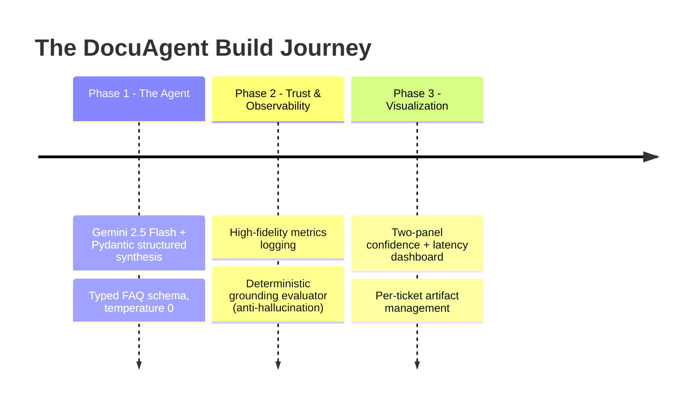
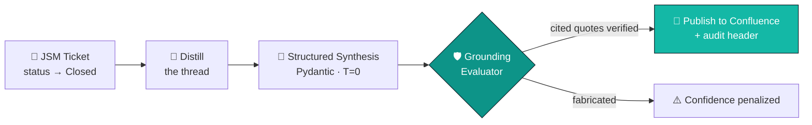

<div align="center">

# 🛡️ DocuAgent

### Autonomous JSM → Confluence FAQ Synthesis — *with a confidence score you can actually defend*


<br/>


</div>

---

## ✨ The One-Liner

Engineering teams solve hard problems inside Jira Service Management threads — then close the ticket, and the knowledge evaporates. The obvious AI fix (summarize the thread into an FAQ) makes it *worse*, because language models hallucinate steps that were never in the conversation, and nobody can tell which claims are real.

**DocuAgent fixes the trust problem, not just the writing problem.** It synthesizes a clean Confluence FAQ from a closed ticket — and then *verifies every cited claim against the original thread using deterministic code*, attaching an auditable confidence score the model is never allowed to grade itself.

> 🔴 **The AI imperative:** Remove the LLM and DocuAgent stops working. The synthesis, extraction, and reasoning are pure structured-LLM orchestration. But the *trust layer* on top is deliberately **not** an LLM — that's the whole point.

---

## 👥 The Team

| | |
|---|---|
| **Ahmed Aribi** | MPI Student @ INSAT · Algorithms & Competitive Programming · AI Engineering |
| **Myriam Gamra** | MPI Student @ INSAT · NTRF Alumna · Core AI & Pipeline Development |

Two INSAT students who wanted to build something that doesn't just *look* smart in a demo, but holds up when a judge asks *"how do you know it isn't making that up?"*

---

## 🏗️ How We Built It

We built DocuAgent in three deliberate phases — generation first, **trust second**, polish last.



**Phase 1 — The Agent.** We started with the core engine: a `DocuAgentEngine` that sends a messy ticket thread to Gemini 2.5 Flash under a strict Pydantic `response_schema`, at temperature 0, returning a strongly-typed `ResolutionVerdict` (title, summary, root cause, ordered fix steps, plus an explainability trace). Generation working, structured, reproducible.

**Phase 2 — Logging & AI Security.** Generation alone isn't trustworthy, so we hardened it. We added latency timing around every Gemini call and routed timestamped, level-tagged metrics into a proper log file. Then came the centerpiece: a **deterministic grounding evaluator** that throws away the model's self-reported confidence and recomputes it from scratch — *does each quote the model cited actually exist in the source ticket?* This is the layer that catches hallucinations.

**Phase 3 — Visualization.** Finally, we turned the numbers into something a human can read at a glance: check this  to visit the dashboard.

---

## 🔄 The Pipeline



The fourth stage is the one nobody else has.

---

## 🛡️ The Star: Deterministic Grounding Evaluator

The model writes the FAQ. It does **not** get to grade itself. After synthesis, `src/evaluator.py` recomputes the confidence score by normalized string matching against the raw logs — pure standard-library Python, no second LLM call, **zero added latency**.

| Citation type | Score | Logic |
|---|:---:|---|
| ✅ **Verbatim match** | `1.00` | Quote found word-for-word (after normalization) in the source |
| 🟡 **Close paraphrase** | `0.60` | ≥85% token overlap — grounded, but capped below perfect |
| 🔴 **Fabricated quote** | `≈0.07` | Not in the source → `overlap × 0.30`, heavily penalized |
| ⚪ **No citations** | `0.25` | Unsourced floor — an article with no evidence cannot be trusted |

The final confidence is the **mean grounding score across all citations**, so a single hallucinated quote drags the whole article down. Normalization handles casing, punctuation, and underscores (`POOL_MAX` → `pool max`), so genuine matches pass and invented ones don't.

```python
ev = DocuEvaluator()
ev.calculate_confidence(raw_logs, citations)   # → dynamic float in [0.0, 1.0]
ev.validate_against_source(raw_logs, citations) # → True only if every quote is verbatim
```

---

## 📊 Data Visualization

We will be working on visualizing data and turning the JSON queries into a graphical, easy-to-understand visualization, using Matplotlib and pure Python!

<div align="center">

<!-- Generated by: python tests/test_synthetic_payloads.py -->


*Regenerated on every harness run — the chart above appears once you run the evaluation.*

</div>

Every run also logs per-ticket metrics (timestamp · level · ticket ID · confidence · latency) to `tests/test_run.log` and saves each structured payload to `tests/artifacts/output_<TICKET>.json`.

---

## 🚀 Quick Start

```bash
# 1. Install dependencies (matplotlib included for the dashboard)
pip install -r requirements.txt

# 2. Add your key to a local .env file (never commit this)
echo "GEMINI_API_KEY=your_key_here" > .env

# 3. Run a single live synthesis
python src/agent.py

# 4. Run the full evaluation sweep → artifacts + log + dashboard
python tests/test_synthetic_payloads.py

# 5. (Optional) structural unit test
python -m unittest tests.test_synthetic_payloads
```

> 💡 The `google-genai` client reads `GEMINI_API_KEY` (or `GOOGLE_API_KEY`) from the environment automatically. Atlassian credentials are only needed once the live Confluence loop is wired (see roadmap).

---

## 📁 Repository Structure

```text
docuagent/
├── config/
│   └── settings.py              # Environment and system parameters
├── src/
│   ├── __init__.py
│   ├── agent.py                 # Gemini synthesis + grounding integration hook
│   ├── atlassian_client.py      # Jira/Confluence REST integration (mock today)
│   └── evaluator.py             # ⭐ Deterministic grounding evaluator
├── tests/
│   ├── test_synthetic_payloads.py  # Eval harness: artifacts + metrics + dashboard
│   ├── artifacts/               # Generated JSON payloads        (git-ignored)
│   ├── test_run.log             # Timestamped metrics log         (git-ignored)
│   └── confidence_report.png    # Generated two-panel dashboard
├── .env                         # Local secrets                   (git-ignored)
├── .gitignore
├── README.md
└── requirements.txt
```

---

## 🟢 Status: Working Today vs. Next

| ✅ Working today | 🔜 Next |
|---|---|
| Grounded synthesis engine (live Gemini calls) | Live Atlassian read/write (mock client today) |
| Deterministic confidence scoring | LLM-as-judge second verification layer |
| Metrics logging + evaluation dashboard | Webhook ingress on real JSM closures |
| Model pinned (`gemini-2.5-flash`) for reproducibility | Confidence-gated publishing thresholds |

We're upfront about this: the hard, novel part — **grounded synthesis with a defensible confidence score** — is real and running on live model calls. The Atlassian client is a designed interface with a mock implementation; wiring it to live Confluence is the immediate next step.

---

## 🧰 Tech Stack

**Google Gemini 2.5 Flash** (structured outputs, `temperature=0`) · **Pydantic** (typed schemas) · **Flask** (dashboard) · **Python standard library** (deterministic evaluator + logging) · **Atlassian REST** (Jira / Confluence)

---

<div align="center">

**Documentation that earns trust.**

*Built with care for the AINS Hackathon 2026 by Ahmed Aribi & Myriam Gamra.*

</div>
